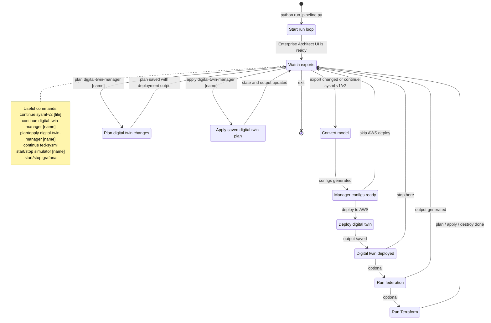

# Cloud DTC Pipeline State Diagram

```mermaid
stateDiagram-v2
    state "Start run loop" as Start
    state "Watch exports" as Watch
    state "Convert model" as Convert
    state "Manager configs ready" as Configs
    state "Deploy digital twin" as Deploy
    state "Digital twin deployed" as Deployed
    state "Plan digital twin changes" as ManagerPlan
    state "Apply saved digital twin plan" as ManagerApply
    state "Run federation" as Federation
    state "Run Terraform" as Terraform

    [*] --> Start: python run_pipeline.py
    Start --> Watch: Enterprise Architect UI is ready
    Watch --> Convert: export changed or continue sysml-v1/v2
    Convert --> Configs: configs generated

    Configs --> Watch: skip AWS deploy
    Configs --> Deploy: deploy to AWS
    Deploy --> Deployed: output saved

    Deployed --> Watch: stop here
    Watch --> ManagerPlan: plan digital-twin-manager [name]
    ManagerPlan --> Watch: plan saved with deployment output
    Watch --> ManagerApply: apply digital-twin-manager [name]
    ManagerApply --> Watch: state and output updated
    Deployed --> Federation: optional
    Federation --> Watch: output generated
    Federation --> Terraform: optional
    Terraform --> Watch: plan / apply / destroy done

    Watch --> [*]: exit

    note right of Watch
        Useful commands:
        continue sysml-v2 [file]
        continue digital-twin-manager [name]
        plan/apply digital-twin-manager [name]
        continue fed-sysml
        start/stop simulator [name]
        start/stop grafana
    end note
```
